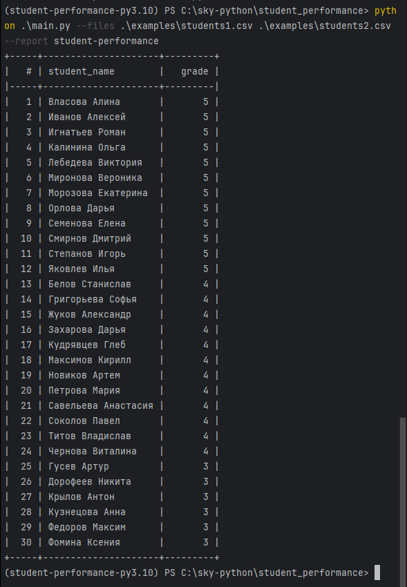

# Анализ успеваемости студентов

## Пример запуска


## Запуск

### Клонируем репозиторий
```bash
git clone https://github.com/maxmaleev1/student_performance.git
```

### Заходим в папку проекта
```bash
cd student_performance
```

### Устанавливаем Poetry (если ещё не установлен)
```bash
pip install poetry
```

### Устанавливаем зависимости проекта
```bash
poetry install
```
## Запускаем
Пример запуска на двух CSV - students1.csv и students2.csv
```bash
poetry run python main.py --files examples/students1.csv examples/students2.csv --report student-performance
```

В PowerShell (Windows):
```powershell
poetry run python .\main.py --files .\examples\students1.csv .\examples\students2.csv --report student-performance
```
## Файлы CSV
Файлы CSV должны содержать следующие колонки:
```
student_name,subject,teacher_name,date,grade
```
### Пример входного файла: [students1.csv](examples/students1.csv), [students2.csv](examples/students2.csv)
```
student_name,subject,teacher_name,date,grade
Семенова Елена,Английский язык,Ковалева Анна,2023-10-10,5
Титов Владислав,География,Орлов Сергей,2023-10-12,4
Власова Алина,Биология,Ткаченко Наталья,2023-10-15,5
```

## Как добавить новый отчёт
1. В папке `student_performance/reports/` создать новый файл, например `teacher_performance.py`.  
2. В этом файле определить функцию, которая принимает список строк CSV (`rows`).  
   Функция должна вернуть кортеж:  
   - заголовки колонок (`tuple[str]`),  
   - данные строк (`list[tuple]`).  
3. Зарегистрировать функцию через декоратор `@register('report-name')`.  
   Пример:
   ```python
   from collections import defaultdict
   from ..registry import register

   @register('teacher-performance')
   def build_teacher_performance(rows):
       # логика формирования отчёта
       return ('teacher_name', 'avg_grade'), result

4. Новый файл автоматически подключится через пакет reports, и отчёт станет 
   доступен через командную строку:
    ```python
    python main.py --files examples/students1.csv --report teacher-performance
