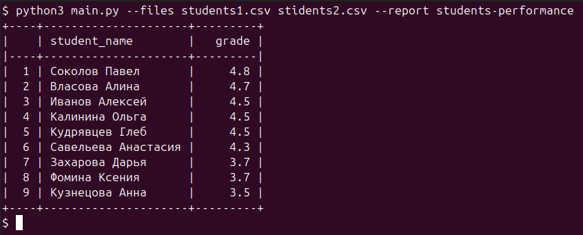

# Тестовое задание Python
## Анализ успеваемости студентов

### Что нужно сделать?
Нужно написать скрипт для обработки CSV-файла.  
Скрипт читает файлы с данными (см. примеры ниже) об успеваемости студентов и формирует отчёты.  
Нужно сформировать всего один отчёт **student-performance** (см. пример ниже).  
Отчёт включает в себя список студентов и среднюю оценку студента.  
Среднее считается по всем предметам, студенты сортируются по успеваемости.  
Название файлов (может быть несколько) и название отчёта передаётся в виде параметров `--files` и `--report`.  
Отчёт формируется по всем переданным файлам, а не по каждому отдельно.  

Чтобы сфокусироваться на функционале формирования отчёта и не отвлекаться на рутинные задачи (обработку параметров скрипта, чтения файлов и вывод), можно использовать стандартную библиотеку **argparse** и **csv**, а для отображения в консоли — библиотеку **tabulate**.  

### Пример входного файла: [students1.csv](examples/students1.csv), [students2.csv](examples/students2.csv)
```
student_name,subject,teacher_name,date,grade
Семенова Елена,Английский язык,Ковалева Анна,2023-10-10,5
Титов Владислав,География,Орлов Сергей,2023-10-12,4
Власова Алина,Биология,Ткаченко Наталья,2023-10-15,5
```

### Пример запуска
```bash
python main.py --files students1.csv students2.csv --report student-performance
```

### Пример отчёта


### Функциональные требования
- Можно передать пути к файлам.  
- Можно указать название отчёта.  
- В консоль выводится отчёт в виде таблицы.  

### Нефункциональные требования
- Для всего кроме тестов и вывода в консоль использовать только стандартную библиотеку.  
  - Для обработки параметров — `argparse`, нельзя использовать `click`.  
  - Для чтения файлов — `csv`, нельзя использовать `pandas`.  
- Архитектура должна позволять добавлять новые отчёты.  
- Код покрыт тестами на **pytest**.  
- Для тестов можно использовать любые дополнительные библиотеки.  
- Код должен соответствовать стандартам написания Python-проектов и стилю PEP8.  

### Сдача задания
- Репозиторий должен быть публичным на GitHub (не Google Drive и не Яндекс.Диск).  
- Нужно приложить примеры запуска скрипта (лучше со скриншотами).  
- Перед отправкой ссылки убедиться, что репозиторий доступен.  

### FAQ
- **Нейросети**: использовать не рекомендуется.  
- **Тесты обязательны**: без тестов задание не принимается.  
- **Покрытие тестами**: ориентироваться на ~80% и выше, главное — покрыть критически важный функционал.  
- **pytest**: можно использовать плагины и вспомогательные библиотеки.  
- **Линтеры и форматтеры**: использовать можно и рекомендуется.  
- **Зависимости**: можно использовать не только pip, приветствуется Poetry.  
- **API**: названия и формат параметров менять нельзя (`--files`, `--report`).  
- **Ошибки ввода**: пользователь может ввести неверные аргументы, это нужно обрабатывать.  
- **Большие файлы**: учитывать не нужно (читаем всё в память).  
- **Комментарии**: писать можно при необходимости.  
- **На что смотрит ревьюер**: выполнение требований, стиль, архитектура.  
- **Новые отчёты**: будут использовать тот же формат CSV (новые колонки не появятся).  
- **README.md**: обязателен, но короткий и по делу (примеры запуска + описание).  
